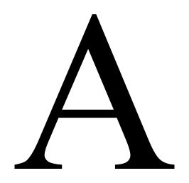
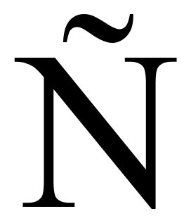
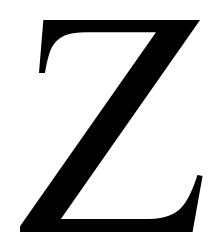
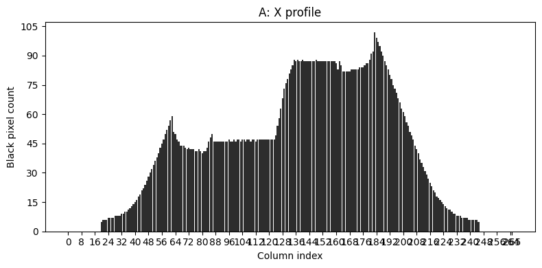
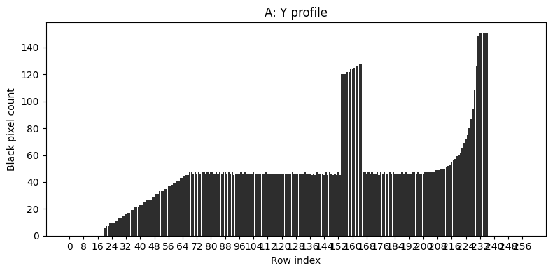

# Feature extraction — Испанские заглавные (вариант 14)

Скрипт генерирует эталонные изображения испанских заглавных букв (включая `Ñ`), вычисляет по ним признаки и сохраняет результаты в удобных папках/файлах, внешний вид символов базируется на системных шрифтах.

## Что делает проект

- генерирует черно-белые PNG для всех гербов `A…Z` + `Ñ`, обрезая лишний белый фон и добавляя небольшой отступ для наглядности;
- вычисляет вес в каждой четверти, нормированный вес, центр тяжести, нормированные координаты, осевые моменты инерции и их нормированные версии;
- сохраняет скалярные признаки в `data/features/spanish_uppercase_features.csv` (разделитель `;`);
- строит профили по каждому направлению (`X`, `Y`) и сохраняет их как «столбчатые» диаграммы с целыми подписями на осях.

## Иллюстрации

В папке `data/images/spanish_uppercase` лежит по одному PNG-образцу каждой буквы. Ниже показаны три характерных примера, взятые из испанского алфавита:

| Буква | Пример |
|---|---|
| `A` |  |
| `Ñ` |  |
| `Z` |  |

### Профили

Для каждого символа строится профиль по строкам и столбцам. Пример для `A`:

| Профиль по X | Профиль по Y |
|---|---|
|  |  |

Графики оформлены как в шаблоне: подписанные оси, ровные столбцы, и сохраняются без GUI благодаря `matplotlib` с backend `Agg`.

## Структура каталога

- `feature_extraction.py` — главный скрипт;
- `requirements.txt` — зависимости (`Pillow`, `numpy`, `matplotlib`);
- `data/images/spanish_uppercase/` — сгенерированные символы;
- `data/features/` — `*.csv` с признаками;
- `data/profiles/x/` и `data/profiles/y/` — графики профилей для каждой буквы.

## Как воспроизвести

```sh
python -m pip install -r requirements.txt
python feature_extraction.py
```

Скрипт перезаписывает данные, поэтому достаточно запустить его после редактирования шрифтов или перечня символов.

## Формат CSV

Каждая строка описывает букву. Колонки:

1. `letter` — буква из набора `ABCDEFGHIJKLMNÑOPQRSTUVWXYZ`.
2. `total_mass` — число пикселей черного.
3. `tl_mass/tr_mass/bl_mass/br_mass` — веса четвертей (в порядке TL, TR, BL, BR).
4. `tl_density/…/br_density` — веса, нормированные на площадь соответствующей четверти.
5. `center_x/center_y` — координаты центра тяжести (пиксели).
6. `center_x_norm/center_y_norm` — нормированные центра (диапазон 0…1).
7. `moment_h/moment_v` — осевые моменты по горизонтальной и вертикальной прямым через центр;
8. `moment_h_norm/moment_v_norm` — моменты, деленные на `total_mass`.
9. `width/height` — размеры итогового изображения.

## Графики профилей

Профили хранятся в `data/profiles/x/` и `data/profiles/y/` с названиями `<letter>.png`. Каждая диаграмма:

- столбцы показывают число «черных» пикселей по соответствующим строкам или столбцам;
- оси подписаны целыми числами благодаря `MaxNLocator(integer=True)`;
- сохраняются без наложенного интерфейса (`Agg`), поэтому скрипт можно запускать на сервере.

## Инструменты и заметки

- Используется системный шрифт (по умолчанию `Times New Roman`) или ближайший доступный вариант из списка.
- Подбор размеров (поле `FONT_SIZE` и `CANVAS_SIZE`) гарантирует баланс между резкостью и достаточным пространством вокруг символа.
- Для `Ñ` и других «нестандартных» символов изображение строится точно так же — достаточно, чтобы шрифт поддерживал символ.
